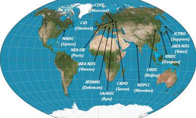

<head>
<link rel="stylesheet" type="text/css" href="css/nrdc.css"/>
</head>
<body>
<h3>
NRDC GitHub Test Homepage
</h3>

The International Network of Nuclear Reaction Data Centres (NRDC) constitutes a worldwide cooperation of nuclear data centres under the auspices of the International Atomic Energy Agency. The Network was established to coordinate the world-wide collection, compilation and dissemination of nuclear reaction data.

 
</body>
